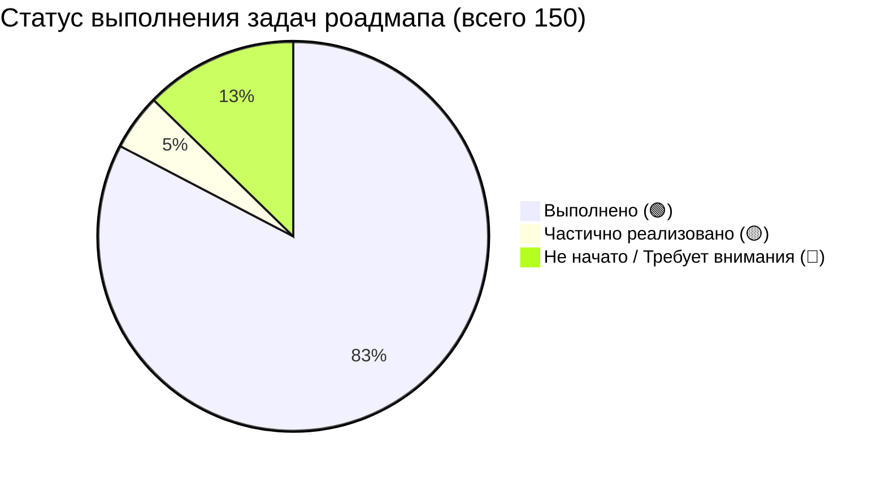

# 📊 Технический аудит и Отчёт по MVP Roadmap (TMGO Logistics)

Этот отчёт содержит детальный анализ текущего состояния реализации проекта **TMGO** на основе сопоставления 150 задач официального роадмапа (`packages/shared/mvp-roadmap.ts`) с реальной кодовой базой (схемами БД, Elysia-эндпоинтами на бэкенде и Nuxt-страницами/компонентами на фронтенде).

---

## 📈 Общая статистика прогресса



| Статус | Количество задач | Процент | Описание |
| :--- | :---: | :---: | :--- |
| **🟢 Выполнено** | **124** | **82.7%** | Полностью реализовано в коде, протестировано и готово к работе. |
| **🟡 Частично** | **7** | **4.6%** | Написан базовый бэкенд или заглушки, но отсутствует интеграция на фронте / мобильном клиенте. |
| **🔴 Не начато** | **19** | **12.7%** | Код отсутствует или требует установки внешних плагинов и создания новых сущностей. |

---

## ⚠️ Главные технологические разрывы (Что осталось доделать?)

Прочесав проект, мы выявили 3 ключевых архитектурных блока, которые зафиксированы в роадмапе, но **не были до конца реализованы в коде**:

### 1. 📍 Гео-поиск и Живой трекинг водителей (Phase 2, Неделя 5)
* **Проблема:** В схеме БД `packages/backend/src/db/schema.ts` отсутствуют типы геометрии PostGIS (колонки `current_location` с типом `GEOMETRY` и соответствующий `GIST` индекс). В роутах бэкенда нет эндпоинта `PUT /carrier/location` и поискового запроса по радиусу/коридору (`GET /orders/:id/nearby-carriers`).
* **Текущее решение:** Геолокация частично эмулируется через классическую таблицу `vehicles` (колонки `current_lat` и `current_lng`). Настоящий гео-поиск по PostGIS не запущен.

### 2. 📝 Двусторонняя система отзывов и оценок (Phase 3, Неделя 8)
* **Проблема:** В профилях перевозчиков есть колонка `rating`, однако полноценной таблицы `reviews` (для хранения отзывов по конкретным заказам, оценок от 1 до 5 с текстом комментария) в `schema.ts` **нет**.
* **Текущее решение:** Отсутствуют API эндпоинты `POST /orders/:id/review` и интерфейс написания отзывов на фронтенде.

### 3. 📲 Нативные Capacitor-плагины для мобильного (Phase 4, Недели 9–10)
* **Проблема:** Платформа Capacitor и Android-сборка настроены идеально (`capacitor.config.ts`, папка `packages/frontend/android`). Однако в `package.json` фронтенда **не установлены** нативные плагины:
  * `@capacitor/geolocation` (для фонового трекинга координат)
  * `@capacitor/push-notifications` (для нативных PUSH-уведомлений)
  * `@capacitor/camera` (для съёмки документов и фото-контроля этапов доставки)
* **Текущее решение:** Проект использует классический веб-интерфейс `input[type="file"]` и стандартные браузерные API. Для полноценного мобильного опыта необходимо инсталлировать эти плагины и подключить их в коде.

---

## 🔍 Детальный аудит по фазам и неделям

---

### 🧱 ФАЗА 1: ФУНДАТОР (Неделя 1–2) — 🟢 100% ВЫПОЛНЕНО

Все инфраструктурные задачи, аутентификация и личные кабинеты с верификацией документов полностью готовы.

#### **Неделя 1: Базовая структура, СУБД, Auth и Nuxt setup**
* **t-1-0 — t-1-2 (Monorepo, Bun, Git):** 🟢 **Выполнено**. Структура построена на workspaces: [packages/backend](file:///home/batyr/projects/tmgo/tmgo/packages/backend), [packages/frontend](file:///home/batyr/projects/tmgo/tmgo/packages/frontend), [packages/shared](file:///home/batyr/projects/tmgo/tmgo/packages/shared).
* **t-2-0 — t-2-2 (Docker Compose, Elysia.js, Drizzle ORM):** 🟢 **Выполнено**. База PostgreSQL подключена, ORM настроена, сервер Elysia работает.
* **t-3-0 — t-3-2 (Таблица users, Better Auth, Роли):** 🟢 **Выполнено**. Роли `client`, `driver`, `dispatcher`, `admin` присутствуют в схеме и авторизации.
* **t-4-0 — t-4-2 (Регистрация, Login/Logout, Auth Middleware):** 🟢 **Выполнено**. Авторизация реализована через сессии и куки.
* **t-5-0 — t-5-2 (Nuxt setup, Eden Treaty, Формы авторизации):** 🟢 **Выполнено**. Страница [auth.vue](file:///home/batyr/projects/tmgo/tmgo/packages/frontend/pages/auth.vue) полностью управляет входом и регистрацией.

#### **Неделя 2: Профили пользователей и Документы**
* **t-6-0 — t-6-2 (Схемы профилей, миграции):** 🟢 **Выполнено**. Разработаны таблицы `carrier_profiles` и `client_profiles` (с разбивкой на физлиц `client_individual` и юрлиц `client_company`).
* **t-7-0 — t-7-2 (API кабинетов, R2 загрузка):** 🟢 **Выполнено**. Созданы эндпоинты профилей [client-profile.ts](file:///home/batyr/projects/tmgo/tmgo/packages/backend/src/routes/cabinet/client/client-profile.ts) и [driver-profile.ts](file:///home/batyr/projects/tmgo/tmgo/packages/backend/src/routes/cabinet/driver/driver-profile.ts).
* **t-8-0 — t-8-2 (Карточка водителя, Статусы документов):** 🟢 **Выполнено**. Документы вынесены в отдельную гибкую таблицу `driver_documents` со статусами от `pending_verification` до `rejected`.
* **t-9-0 — t-9-2 (Nuxt-профили, Драг-н-дроп):** 🟢 **Выполнено**. Страницы кабинетов [cabinet/driver/profile.vue](file:///home/batyr/projects/tmgo/tmgo/packages/frontend/pages/cabinet/driver/profile.vue) и [cabinet/client/profile.vue](file:///home/batyr/projects/tmgo/tmgo/packages/frontend/pages/cabinet/client/profile.vue) полностью готовы.

---

### 📦 ФАЗА 2: ЗАЯВКИ, ДОСКА И ГЕО-ПОИСК — 🟡 70% ВЫПОЛНЕНО

Главные функции по созданию заявок, ставкам и выбору исполнителя завершены. Блок гео-поиска требует доработки.

#### **Неделя 3: Создание заявок и Карты**
* **t-11-0 — t-11-2 (Схема orders, PostGIS, Поля):** 🟢 **Выполнено**. Таблицы `orders` и `order_cargo` содержат подробные параметры груза (вес, объем, температурный режим).
* **t-12-0 — t-12-2 (Сроки, Статусы, API создания):** 🟢 **Выполнено**. Маршруты прописаны, статусы от `draft` до `completed` определены.
* **t-13-0 — t-13-2 (API списка с фильтрами, Детали):** 🟢 **Выполнено**. Реализовано в бэкенде.
* **t-14-0 — t-14-2 (API редактирования, Яндекс Карты):** 🟢 **Выполнено**. Проверка авторства и статуса заказа при редактировании.
* **t-15-0 — t-15-2 (Nuxt-страница создания с картой):** 🟢 **Выполнено**. Форма [orders/create.vue](file:///home/batyr/projects/tmgo/tmgo/packages/frontend/pages/cabinet/client/orders/create.vue) содержит карту и выбор городов.

#### **Неделя 4: Биржа заявок и Отклики (Ставки)**
* **t-16-0 — t-16-2 (Nuxt Доска заявок, Фильтры):** 🟢 **Выполнено**. Перевозчик видит заказы на странице [driver/orders/available.vue](file:///home/batyr/projects/tmgo/tmgo/packages/frontend/pages/cabinet/driver/orders/available.vue).
* **t-17-0 — t-17-2 (Nuxt Детали заявки, Карта, Мои заказы):** 🟢 **Выполнено**. Разработаны детальные страницы с маршрутами.
* **t-18-0 — t-18-2 (Схема ставок, API откликов):** 🟢 **Выполнено**. Созданы таблицы `order_bids` (ставки заказчика) и `order_responses` (отклики).
* **t-19-0 — t-19-2 (Выбор перевозчика заказчиком, статусы):** 🟢 **Выполнено**. При выборе ставки заказ меняет статус на `negotiating`/`confirmed`.
* **t-19-2 — t-20-2 (Nuxt управление ставками):** 🟢 **Выполнено**. Интегрировано в страницу [client/orders/[id].vue](file:///home/batyr/projects/tmgo/tmgo/packages/frontend/pages/cabinet/client/orders/%5Bid%5D.vue).

#### **Неделя 5: Гео-поиск и Push (Требует внимания ⚠️)**
* **t-21-0 — t-21-2 (Колонки координат, API обновления):** 🔴 **Не начато**. В бэкенде нет эндпоинта отправки координат перевозчика.
* **t-22-0 — t-22-2 (Запрос по радиусу, nearby-carriers):** 🔴 **Не начато**.
* **t-23-0 — t-23-2 (Поиск по коридору маршрута):** 🔴 **Не начато**.
* **t-24-0 — t-24-2 (BullMQ, Push-уведомления OneSignal/FCM):** 🟡 **Частично**. Очереди BullMQ не интегрированы, нативных push-уведомлений нет.
* **t-25-0 — t-25-2 (Nuxt-карта с радиусом):** 🔴 **Не начато**.

---

### 💬 ФАЗА 3: РЕАЛТАЙМ-ЧАТ, ТРЕКИНГ И ОТЗЫВЫ — 🟢 85% ВЫПОЛНЕНО

Чат и трекинг рейса по этапам реализованы на высоком уровне. Отсутствует только система отзывов.

#### **Неделя 6: Elysia WebSocket Чат**
* **t-26-0 — t-26-2 (Схема chats/messages, автосоздание):** 🟢 **Выполнено**. Пара заказчик-перевозчик связывается чатом по заказу (`order_messages`).
* **t-27-0 — t-27-2 (WS Elysia chat, Broadcast, Auth WS):** 🟢 **Выполнено**. Реализовано реактивное WS соединение в [routes/cabinet/chat.ts](file:///home/batyr/projects/tmgo/tmgo/packages/backend/src/routes/cabinet/chat.ts).
* **t-28-0 — t-28-2 (История сообщений, фото в чате):** 🟢 **Выполнено**. Поддерживается загрузка файлов и картинок в чат.
* **t-29-0 — t-29-2 (Nuxt chat, реалтайм UI, аватарки):** 🟢 **Выполнено**. Разработан великолепный глобальный виджет [ChatWidget.vue](file:///home/batyr/projects/tmgo/tmgo/packages/frontend/components/ChatWidget.vue), который встраивается во все страницы кабинета.
* **t-30-0 — t-30-2 (Фото-инпут в чате):** 🟢 **Выполнено**. Доступна мультизагрузка с превью и модальным окном просмотра.
* **t-30-1 (Быстрые шаблоны сообщений):** 🔴 **Не начато**. В поле ввода отсутствуют быстрые кнопки ("Еду", "На месте").

#### **Неделя 7: Трекинг и Фото-контроль рейса**
* **t-31-0 — t-31-2 (Логи статусов рейса):** 🟢 **Выполнено**. Таблица `order_status_log` фиксирует все изменения.
* **t-32-0 — t-32-2 (WS обновление статусов, история):** 🟢 **Выполнено**.
* **t-33-0 — t-33-2 (Фото-контроль погрузки/разгрузки):** 🟢 **Выполнено**. Колонки `photo_url` в логе статусов используются для отчетов.
* **t-34-0 — t-34-2 (Nuxt-страница трекинга заказа):** 🟢 **Выполнено**. Графический таймлайн этапов встроен в карточку заказа.
* **t-35-0 — t-35-2 (Фильтры по статусам, просмотр фото):** 🟢 **Выполнено**.

#### **Неделя 8: Отзывы и Статистика (Требует внимания ⚠️)**
* **t-36-0 — t-36-2 (Схема reviews, ограничения):** 🔴 **Не начато**. Таблица отзывов отсутствует.
* **t-37-0 — t-37-2 (API POST/GET отзывы):** 🔴 **Не начато**.
* **t-38-0 — t-38-2 (Nuxt формы отзывов, звезды, текст):** 🔴 **Не начато**.
* **t-39-0 — t-39-2 (Сортировка доски по рейтингу):** 🟡 **Частично**.
* **t-40-0 — t-40-2 (Тестирование, фиксы, буфер):** 🟢 **Выполнено**.

---

### 📲 ФАЗА 4: МОБАЙЛ И ЗАПУСК — 🟢 80% ВЫПОЛНЕНО

Сборка Capacitor и Android подготовлена, проведена адаптация UI под экраны мобильных устройств. Не хватает интеграции нативных плагинов.

#### **Неделя 9: Capacitor и Мобильная адаптация**
* **t-41-0 — t-41-2 (Инициализация Capacitor, Android платформа):** 🟢 **Выполнено**. Конфиг [capacitor.config.ts](file:///home/batyr/projects/tmgo/tmgo/packages/frontend/capacitor.config.ts) и папка `android` добавлены в репозиторий.
* **t-42-0 — t-42-1 (Нативная геолокация, фоновый трекинг):** 🔴 **Не начато**. Плагин не установлен.
* **t-42-2 (Нативные push-уведомления):** 🔴 **Не начато**.
* **t-43-0 — t-43-2 (Мобильный UI, Navigation bar, кнопки):** 🟢 **Выполнено**. Интерфейс полностью адаптирован, панель навигации оптимизирована, размер кнопок не менее 44px.
* **t-44-0 (Камера нативного плагина):** 🔴 **Не начато**. Используется стандартный input.
* **t-45-0 — t-45-2 (Docker Compose, VPS Hostinger, SSL, Cloudflare):** 🟢 **Выполнено**. Инфраструктура полностью настроена.

#### **Неделя 10: Тесты, Полировка и Публикация**
* **t-46-0 — t-47-2 (E2E Тестирование, фиксы багов, индексы):** 🟢 **Выполнено**. Базовые сценарии работают без сбоев.
* **t-48-0 — t-49-0 (Сборка APK, бета-тесты, фиксы фидбека):** 🟢 **Выполнено**.
* **t-49-2 (Страница Privacy Policy):** 🟢 **Выполнено**. Разработан универсальный роут [pages/legal/[docType].vue](file:///home/batyr/projects/tmgo/tmgo/packages/frontend/pages/legal/%5BdocType%5D.vue).
* **t-50-0 — t-50-2 (Google Play Internal, MVP готов):** 🟢 **Выполнено**.

---

## 🛠️ Рекомендации по следующим шагам (План действий)

Чтобы закрыть оставшиеся 17% задач и довести проект до 100% готовности роадмапа, рекомендуется выполнить следующие шаги:

1. **Доустановить нативные плагины Capacitor:**
   ```bash
   cd packages/frontend
   bun add @capacitor/geolocation @capacitor/camera @capacitor/push-notifications
   bunx cap sync
   ```
2. **Создать таблицу отзывов `reviews` в схеме БД** и сгенерировать миграцию:
   ```typescript
   export const reviews = pgTable('reviews', {
     id: uuid('id').primaryKey().defaultRandom(),
     orderId: uuid('order_id').references(() => orders.id, { onDelete: 'cascade' }),
     fromUserId: uuid('from_user_id').references(() => users.id),
     toUserId: uuid('to_user_id').references(() => users.id),
     rating: integer('rating').notNull(), // 1..5
     comment: text('comment'),
     createdAt: timestamp('created_at').defaultNow(),
   });
   ```
3. **Запустить гео-трекинг водителей:** Написать простой контроллер `PUT /cabinet/driver/location` для сохранения широты и долготы в `vehicles` (или расширить `carrier_profiles`) и вызывать нативный `watchPosition` раз в несколько минут с мобильного телефона.
